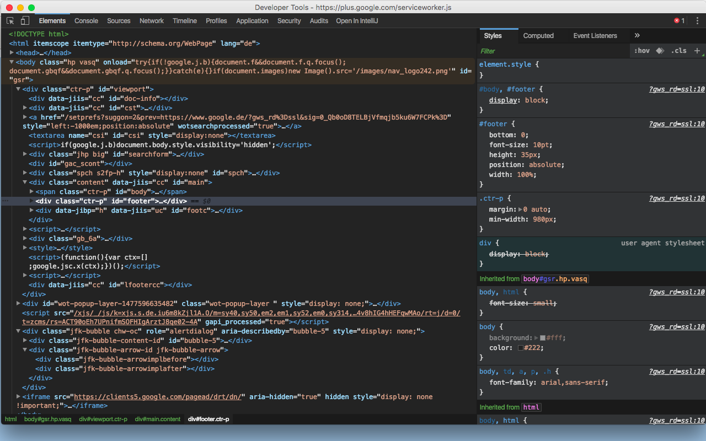

# Chrome DevTools Dark Theme

 
Install from the Chrome Web Store:   
https://chrome.google.com/webstore/detail/chrome-devtools-dark-them/bfcohnmjbpeilfcijkjkeggbdmehhnbk
  
 
After enabling DevTools Experiments in Chrome (http://islegend.com/development/how-to-enable-devtools-experiments-within-google-chrome/), go to DevTools Settings -> Experiments -> Enable "Allow Custom UI themes". Go to Preferences and select Theme: "Dark", which enables Chrome's own Dark Theme. This theme builds on top of that.

